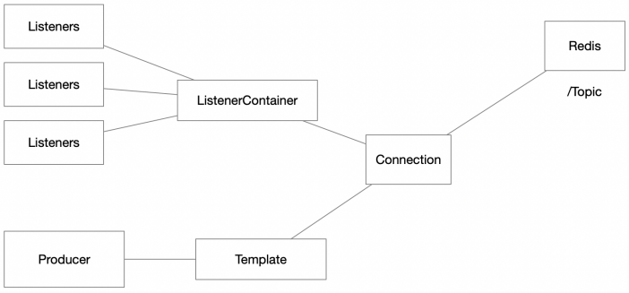

# Arquitecturas de Software (ARSW) - Tarea #4

## Introducción a React-JS

#### Nicolás Toro

[](https://www.oracle.com/java/)
[](https://maven.apache.org/)

---

En este repositorio se muestra la solución a la tarea 4, cuyo enunciado se encuentra en el repositorio en forma de pdf.
Sin embargo, se podrá revisar el paso a paso en este archivo.

El propósito de esta tarea es comprender REACT desde un punto de vista de arquitectura, implementando una arquitectura
cliente-servidor, donde se especifica la separación de responsabilidad entre el cliente (front-end) y el servidor(back-end).


## Estructura del laboratorio

```bash
├── .idea/                          # Configuración propia de IntelliJ IDEA
├── .mvn/                           # Configuración del wrapper de Maven
│   └── wrapper/                    # Scripts y configuraciones del Maven Wrapper
├── img/                            # Carpeta de imágenes para la documentación
│   └── media/                      # Recursos gráficos de apoyo
├── src/                            # Código fuente del proyecto
│   ├── main/                       # Código principal
│   │   └── java/                   
│   │       └── edu/eci/arsw/blueprints/
│   │           ├── controllers/    # Controladores REST (exponen la API)
│   │           ├── filter/         # Interfaces para aplicar filtros a planos
│   │           │   └── impl/       # Implementaciones concretas de filtros
│   │           ├── model/          # Clases del modelo (Blueprint, Point, etc.)
│   │           ├── persistence/    # Interfaces de persistencia
│   │           │   └── impl/       # Implementación en memoria de la persistencia
│   │           └── services/       # Lógica de negocio (servicios)
│   └── test/                       # Código de pruebas
│       └── java/
│           └── edu/eci/arsw/blueprints/test/
│               └── persistence/
│                   └── impl/       # Pruebas unitarias para la capa de persistencia
└── target/                         # Archivos generados por Maven (build)
    ├── classes/                    # Archivos compilados del main
    │   └── edu/eci/arsw/blueprints/
    │       ├── controllers/        
    │       ├── filter/impl/
    │       ├── model/
    │       ├── persistence/impl/
    │       └── services/
    ├── generated-sources/          # Fuentes generadas automáticamente
    │   └── annotations/
    ├── generated-test-sources/     # Fuentes de pruebas generadas
    │   └── test-annotations/
    ├── maven-archiver/             # Metadatos del build Maven
    ├── maven-status/               # Estado del compilador de Maven
    │   └── maven-compiler-plugin/
    │       ├── compile/default-compile/
    │       └── testCompile/default-testCompile/
    ├── surefire-reports/           # Reportes de ejecución de pruebas
    └── test-classes/               # Archivos compilados de test
        └── edu/eci/arsw/blueprints/test/
            └── persistence/impl/

```
---

### Ejecutar el Proyecto

A continuación, se describen los pasos para ejecutar ambos proyectos en cualquier sistema operativo compatible con Java y Maven.

#### 1. Requisitos previos

- **Java 17** o superior instalado y configurado en el `PATH`.
- **Apache Maven** instalado y configurado en el `PATH`.
- (Opcional) Un IDE como IntelliJ IDEA, Eclipse o VS Code para facilitar la edición y ejecución.

Verifica las versiones instaladas ejecutando en la terminal:

```bash
java -version
mvn -version
```

#### 2. Clonar el repositorio

Si aún no tiene el repositorio localmente, clónelo con:

```bash
git clone https://github.com/NicoToro25/ARSW-Laboratorio-5-Blueprints-CSS-JS.git
```

#### 3. Compilar los proyectos

Ejecutar el siguiente código

```bash
mvn clean package
```

#### 4. Ejecutar los proyectos

Ejecutar el siguiente código:

```bash
mvn exec:java@
```

> **Nota:** Si su IDE lo permite, también puede ejecutar directamente las clases principales desde la interfaz gráfica del IDE.

Si se tiene algún inconveniente con la ejecución, asegúrarse de que las variables de entorno de Java y Maven estén correctamente configuradas y de estar ubicado en la carpeta correspondiente antes de ejecutar los comandos.


---

## Arquitectura de la aplicación




### Creando el ambiente de trabajo

1. Para la creación del ambiente de trabajo, se tomó la decisión de crear la aplicación desde la siguiente página 
https://start.spring.io/ donde se utilizó Java 17, Maven y Spring Boot 3.5.6.


2. Se actualizó el pom.xml con las configuraciones de web-MVC de spring boot.


3. Se creó la clase que iniciará el servidor de aplicaciones de Spring con la configuración mínima Web-MVC


4. Se creó el index.html


5. Se corre la clase recién creada, para que se puediera ejecutar de forma adecuada se tuvo que eliminar la clase DemoApplication
que se crea por defecto, con eso nos dió el sigueinte resultado.


6. Se accedió a localhost:8080/status


7. Se accedio a localhost:8080/index.html


### ReactJs

ReactJs es un librería javascript que me permite crear clientes web pesados, dinámicos y flexibles. Es decir es una
alternativa al estilo tradicional de aplicaciones web donde un servidor calcula la
respuesta y me envía una página html para cada petición.

En cambio ReactJS, crea una aplicación completa corriendo en el browser que
interactúa de forma dinámica con el servidor web, pero que no tiene necesariamente
que cargar una página ante cada petición.

En React el programador adicionalmente puede migrar sitios web tradicionales hacia
aplicaciones de una sola página por ejemplo, es decir del estado Gmail, Facebook, o
twitter.

Es mucho mejor alternativa que Angular, ya que desde el punto de vista de
arquitectura simplemente propone una librería de JS. No altera el modelo de
funcionamiento normal del browser y no propone un lenguaje nativo, implementado
con meta-información, como lo hace Angular.

Al aprender React usted aprenderá conceptos avanzados de JS.

#### JSX

JSX es una extensión de sintaxis a JS. JSX permite embeber código HTML dentro de
componentes Js. 

```bash
const hellomsg = <h1>Hello, world!</h1>;
```

Esto no genera una cadena o HTML, en cambio, genera un elemento de React. Más de
esto adelante.

### Mi primer ejemplo React

Se agregó el código dado al index.html con el propósito de cargar REACT y Babel que permite interpretar JSX en desarrollo.


Se creó el primer componente


Se añadió el elemento root al index.html


Se verificó el correcto funcionamiento de la aplicación.


### Actualizando elementos del DOM

Se creó y se invocó el método render de DOM en un código estático.


Se creó un código dinámico


### Componentes y props
